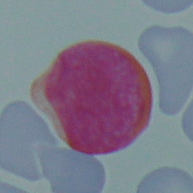
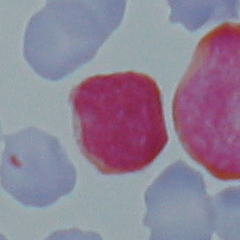
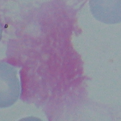
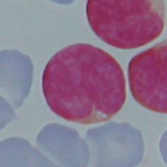

<h1>
<p align="center">
  <br>Cell detector and extractor 🦀
</h1>
  <p align="center">
      Stupid simple algorithm for detecting cells and extracting them into square images.
    <br />
    </p>
</p>


## Usage

Change filename in `detect.py` and run script:

```bash
python detect.py
```

## Computer Vision methods:
- Otsu thresholding
- findContours - RETR_EXTERNAL
- Hu moments

## Cells squares
Note that `detect.py` extract cells into square images into `cells` directory.

<div class="flex">




</div>
